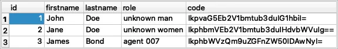

# This is sqlite db server based on Next.js

### Database "users.db" has table "person" that contains informaition in the following form:

### CRUD server has the next endpoints:

| Method  |  Endpoint   |    Description | request with:                                                                                                                                                                                                                                       |
|:--------|-----|-----|:----------------------------------------------------------------------------------------------------------------------------------------------------------------------------------------------------------------------------------------------------|
| CREATE  | /api/person/restore   | Restore table "person" to original state | method:'POST'; headers: 'Content-Type', 'application/json'; body: JSON.stringify({ &nbsp; &nbsp; 'login': 'admin', &nbsp; &nbsp; 'password': '5678' }); redirect: 'follow' |
| CREATE  | /api/person    | Create one person with  firstname, lastname, and role | method:'POST'; headers: 'Content-Type', 'application/x-www-form-urlencoded'; body: '{ &nbsp; &nbsp;'firstName':'Ben', &nbsp; &nbsp;'lastName':'Rogers', &nbsp; &nbsp;'role':'captain' }' redirect: 'follow'                          |
| READ    | /api/person    | Read all persons    | method:'GET'; redirect: 'follow'                                                                                                                                                                  |
| READ    | /api/person/id/[id]   | Read one person by id | method:'GET'; redirect: 'follow'                                                                                                                                                           |
| UPDATE  | /api/person/id/[id]   | Update one person by id | method:'PATCH'; headers: 'Content-Type':['application/x-www-form-urlencoded']}; body: "{ &nbsp; &nbsp;"firstName":"Peter", &nbsp; &nbsp;"lastName":"Parker", &nbsp; &nbsp;"role":"spider-man" }" redirect: 'follow'           |
| DELETE  | /api/person/id/[id]   | Delete one person by id | method:'DELETE'; redirect: 'follow'                                                                                                                                                        |
| DELETE  | /api/person    | Delete all persons    | method:'DELETE'; redirect: 'follow'                                                                                                                                                             |

